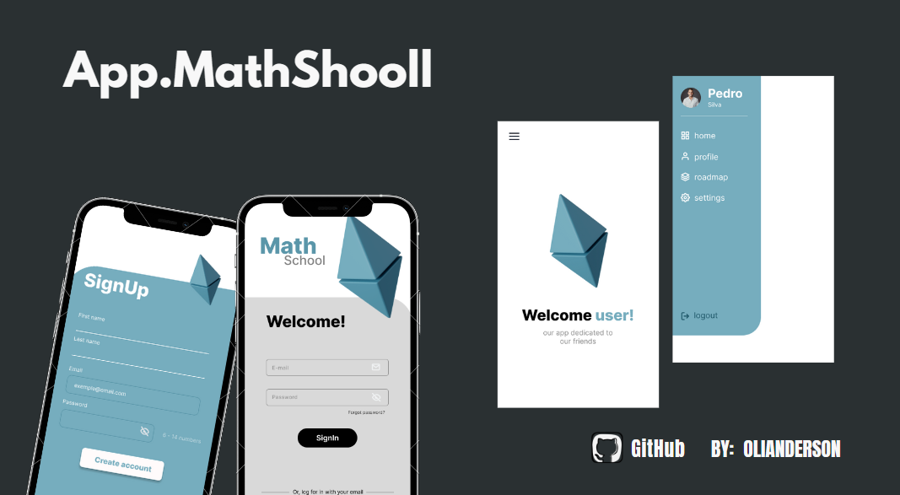

## 💻 Projeto Full Stack App Android fev/2023 


<h1 align="center">
  
</h1>


O projeto consiste em desenvolver uma aplicação mobile, utilizando as tecnologias Java e MySQL. É uma aplicação acadêmica focando na autenticação. Somente um CRUD de usuário e navegação lateral. Para o desenvolvimento do FrontEnd foi utilizado o Android Studio e o desenvolvimento do BackEnd foi feito com Spring Boot e banco de dados MySQL.

## **🔖 Layout**

Você pode ter acesso ao layout do projeto usando esse [LINK](<https://www.figma.com>). É necessário ter conta no [Figma](https://figma.com) para acessá-lo.


## **✨ Características**

- [x] Utilizar a linguagem Java 8;
- [x] Camada de frontend independente do backend (API REST + FrontEnd);
- [x] Bons padrões de desenvolvimento e código limpo;
- [x] Organização dos arquivos dentro do projeto;


## **🛠️ Ferramentas/Tecnologia**

A aplicação foi desenvolvida usando as tecnologias:

- Android Studio (FrontEnd)
- Spring Boot e linguagem Java (BackEnd)
- Retrofit (Consumo da API)
- Git and GitHub 

<a href="https://developer.android.com/studio"> 
<a href="https://www.java.com/"> 
<a href="https://spring.io/projects/spring-boot"> 
<a href="https://spring.io/projects/spring-security"> 
<a href="https://git-scm.com/about"> 

## 🔧 **Running**

```js
git clone
run backend with idle
run frontent with android studio
```


