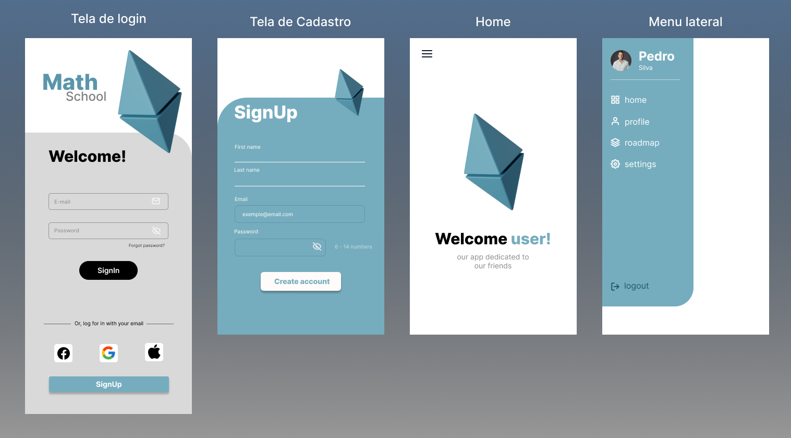

<h1 align="center"> Projeto Full Stack App Android fev/2023 </h1>

 Projeto teste idealizado por: **********. Todos os direitos reservados.

  <a href="#-tecnologias">Tecnologias</a>&nbsp;&nbsp;&nbsp;|&nbsp;&nbsp;&nbsp;
  <a href="#-projeto">Projeto</a>&nbsp;&nbsp;&nbsp;|&nbsp;&nbsp;&nbsp;
  <a href="#-layout">Layout</a>&nbsp;&nbsp;&nbsp;|&nbsp;&nbsp;&nbsp;
  <a href="#-estrutura">Estrutura</a>&nbsp;&nbsp;&nbsp;|&nbsp;&nbsp;&nbsp;
  <a href="#memo-licença">Licença</a>

  

<h1 align="center">
  
</h1>

# 💻 Resumo

O projeto consiste em desenvolver uma aplicação mobile, utilizando as tecnologias Java e MySQL. É uma aplicação acadêmica focando na autenticação. Somente um CRUD de usuário e navegação lateral. Para o desenvolvimento do FrontEnd foi utilizado o Android Studio e o desenvolvimento do BackEnd foi feito com Spring Boot e banco de dados MySQL.

# 🔖 Layout

Você pode ter acesso ao layout do projeto usando esse [LINK](<https://www.figma.com>). É necessário ter conta no [Figma](https://figma.com) para acessá-lo.

# 🔖 Licença

Esse projeto está sob a licença MIT.

SIGILOSO

# 🚀 Estrutura
- Utilizar a linguagem Java 8;
- Camada de frontend independente do backend (API REST + FrontEnd);
- Bons padrões de desenvolvimento e código limpo;
- Organização dos arquivos dentro do projeto;

# 🚀 Tecnologias

A aplicação foi desenvolvida usando as tecnologias:

- Android Studio (FrontEnd)
- Spring Boot e linguagem Java (BackEnd)
- Retrofit (Consumo da API)
- Git and GitHub

<a href="https://www.java.com/"> 
<a href="https://www.java.com/"> 
<a href="https://html.com/html5/"> 
<a href="https://www.w3schools.com/Css/"> 
<a href="https://git-scm.com/about"> 

